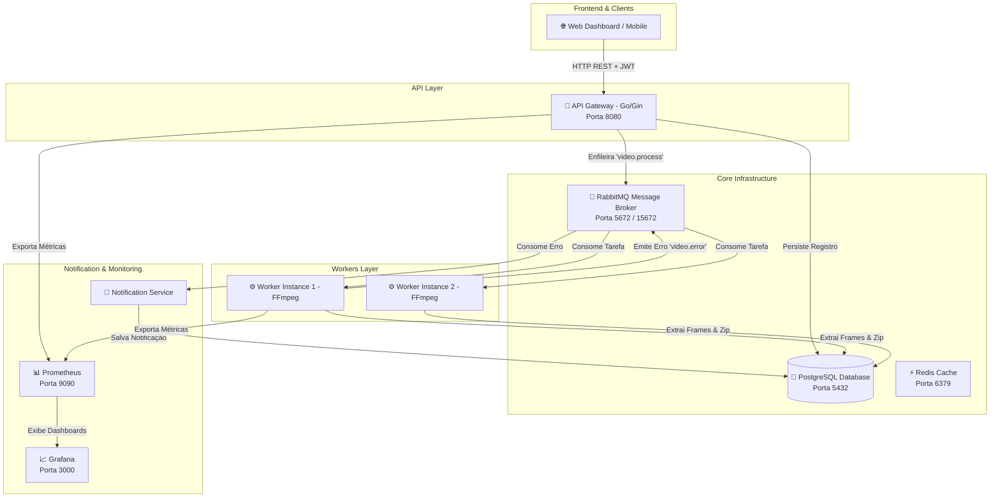

# 🎬 FIAP X - Sistema de Processamento de Vídeos Escalável


Projeto prático final (Hackathon) para a pós-graduação em **Software Architecture da FIAP (SOAT - Fase 5)**.

---

## 📌 1. Sobre o Projeto

O **FIAP X Video Processor** é uma plataforma distribuída e escalável para processamento assíncrono de vídeos. O sistema recebe arquivos de vídeo enviados pelos usuários, extrai as imagens (frames) a cada segundo via **FFmpeg**, compacta o resultado em um arquivo `.ZIP` e disponibiliza para download.

### 🌟 Destaques da Solução:
- **Arquitetura de Microsserviços Orientada a Eventos:** Desacoplamento entre a API Gateway HTTP, o Worker de processamento FFmpeg e o Serviço de Notificação.
- **Resiliência em Picos de Tráfego:** As requisições de upload são enfileiradas duravelmente no **RabbitMQ**, garantindo zero perda de dados.
- **Segurança & Controle de Acesso:** Cadastro e login protegidos com senhas criptografadas (**bcrypt**) e tokens **JWT**.
- **Notificação Automática de Falhas:** Caso um arquivo esteja corrompido ou ocorra erro no FFmpeg, o usuário é alertado e a falha é registrada.
- **Escalabilidade Horizontal:** Workers prontos para escalonamento dinâmico via **Kubernetes HPA**.
- **Observabilidade em Tempo Real:** Coleta de métricas via **Prometheus** e dashboards no **Grafana**.

---

## 🏛️ 2. Arquitetura da Solução



---

## 🛠️ 3. Stack Tecnológica

| Componente | Tecnologia | Função |
| :--- | :--- | :--- |
| **Linguagem** | Go (Golang 1.21) | Alta performance e baixo consumo de recursos |
| **Framework Web** | Gin Gonic | API Gateway HTTP rápido |
| **Mensageria** | RabbitMQ (AMQP) | Fila de tarefas durável com tópicos e DLQ |
| **Banco de Dados** | PostgreSQL 15 | Persistência relacional de usuários, vídeos e notificações |
| **Cache & Sessão** | Redis | Cache de alta velocidade |
| **Processamento de Mídia** | FFmpeg | Extração de frames por segundo |
| **Containers** | Docker & Docker Compose | Containerização dos microsserviços |
| **Orquestração** | Kubernetes | Manifestos K8s, Deployments e Autoscaling (HPA) |
| **Observabilidade** | Prometheus & Grafana | Monitoramento de métricas do sistema |
| **CI/CD** | GitHub Actions | Testes unitários e build automatizados |

---

## 🚀 4. Como Executar o Projeto Localmente

### Pré-requisitos:
- [Docker](https://www.docker.com/) & [Docker Compose](https://docs.docker.com/compose/) instalados.

### Passos para Inicialização:

1. **Clone o repositório:**
   ```bash
   git clone https://github.com/GabrielNascZz/fiap-x-video-processor.git
   cd fiap-x-video-processor
   ```

2. **Suba todo o ambiente com Docker Compose:**
   ```bash
   docker compose up -d --build
   ```

3. **Verifique os containers em execução:**
   ```bash
   docker compose ps
   ```

4. **Acesse as interfaces:**
   - 🌐 **Web Dashboard & API:** [http://localhost:8080](http://localhost:8080)
   - 🐰 **RabbitMQ Management UI:** [http://localhost:15672](http://localhost:15672) *(guest / guest)*
   - 📊 **Prometheus Metrics:** [http://localhost:9090](http://localhost:9090)
   - 📈 **Grafana Dashboards:** [http://localhost:3000](http://localhost:3000) *(admin / admin)*

---

## 🧪 5. Executando os Testes Automatizados

Para rodar os testes unitários e de integração:

```bash
go test -v -race ./...
```

Ou rodar via Docker:

```bash
docker run --rm -v $(pwd):/app -w /app golang:1.21-alpine go test -v ./...
```

---

## ☸️ 6. Implantação no Kubernetes

Os manifestos de implantação para ambiente de produção Kubernetes estão localizados na pasta `k8s/`:

```bash
# Criar o Namespace
kubectl apply -f k8s/namespace.yaml

# Aplicar ConfigMaps e Secrets
kubectl apply -f k8s/configmap.yaml

# Subir Banco de Dados e RabbitMQ
kubectl apply -f k8s/postgres-rabbitmq.yaml

# Aplicar Deployments da API, Worker e HPA
kubectl apply -f k8s/apps.yaml
```

---

## 📚 7. Documentação Adicional

- 🏗️ [Documentação Detalhada de Arquitetura (C4 Model)](docs/ARCHITECTURE.md)
- 📡 [Documentação Completa de Endpoints da API REST](docs/API.md)
- 🗄️ [Script SQL de Criação do Banco de Dados](scripts/sql/init.sql)

---

## ✒️ Autoria & Licença

Projeto desenvolvido para o Hackathon do curso de Pós-Graduação **SOAT - Software Architecture (FIAP)**.
