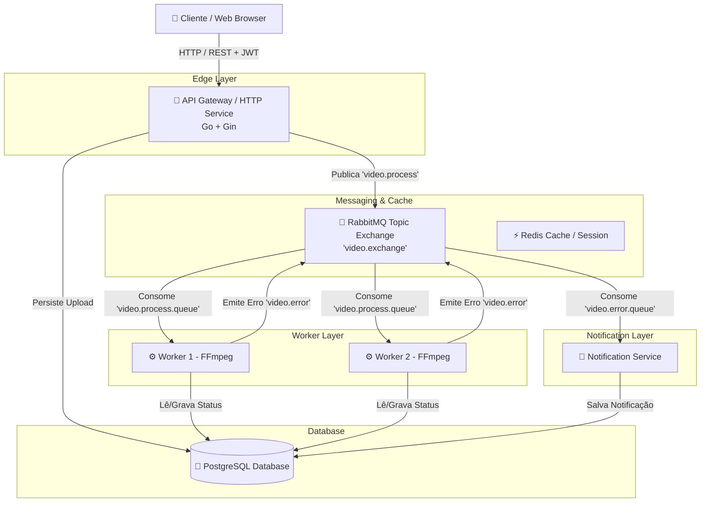
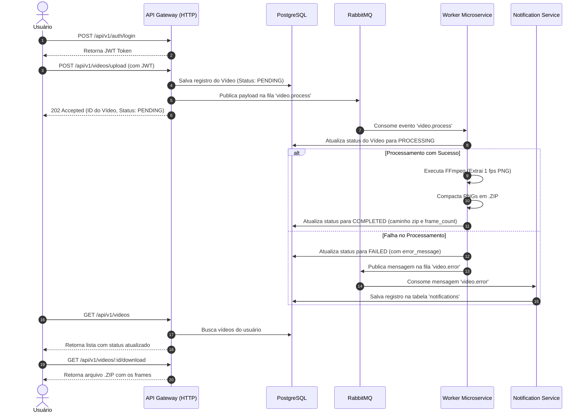
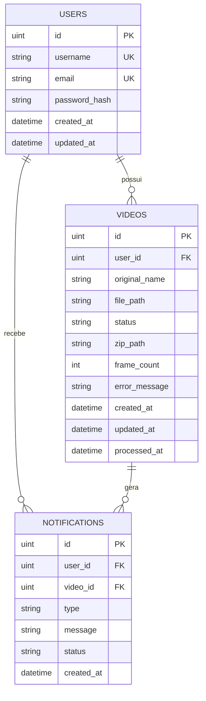

# 🏗️ FIAP X Video Processor - Documentação de Arquitetura

Documentação oficial da arquitetura proposta para a pós-graduação em Software Architecture da FIAP (Fase 5 - Hackathon).

---

## 1. Visão Geral da Solução

O **FIAP X Video Processor** foi desenhado como um **sistema distribuído de microsserviços orientados a eventos (EDA - Event-Driven Architecture)** para processamento de vídeo assíncrono, escalável e resiliente.

### Principais Pilares da Arquitetura:
- **Desacoplamento:** A API HTTP Gateway recebe as requisições de upload de vídeo instantaneamente e as enfileira sem bloquear o usuário.
- **Escalabilidade Horizontal:** Workers de processamento FFmpeg consomem a fila de forma assíncrona e podem ser escalados horizontalmente via Kubernetes HPA.
- **Resiliência a Picos de Tráfego:** Uso de filas duráveis no **RabbitMQ** com mensagens persistentes.
- **Isolamento e Segurança:** Autenticação via **JWT** e senhas hash com **bcrypt**.
- **Notificação de Erros:** Serviço especialista que reage a eventos de erro e registra alertas para os usuários.
- **Observabilidade:** Métricas exportadas via **Prometheus** e visualizadas em dashboards no **Grafana**.

---

## 2. Diagramas de Arquitetura (Mermaid)

### 2.1 Diagrama de Componentes (Visão de Visão de Containers)

---

### 2.2 Fluxo Sequencial de Upload e Processamento (Sequence Diagram)

---

## 3. Modelo de Dados (ERD)

---

## 4. Padrões de Qualidade e Escalabilidade

1. **Horizontal Pod Autoscaling (HPA):** O deployment dos workers no Kubernetes escala automaticamente com base no uso de CPU (alvo: 70%).
2. **Dead Letter Queue (DLQ):** Erros de processamento não travam a fila principal e são redirecionados para rastreamento.
3. **Persistência Volátil Separada de Armazenamento:** Arquivos são armazenados em volumes compartilhados (`shared_storage`) permitindo resiliência em falhas de pods.
